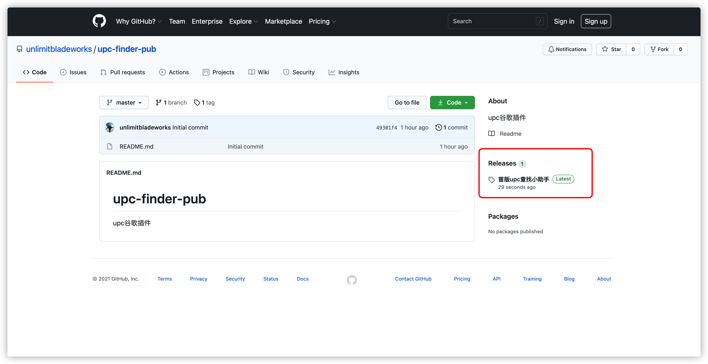
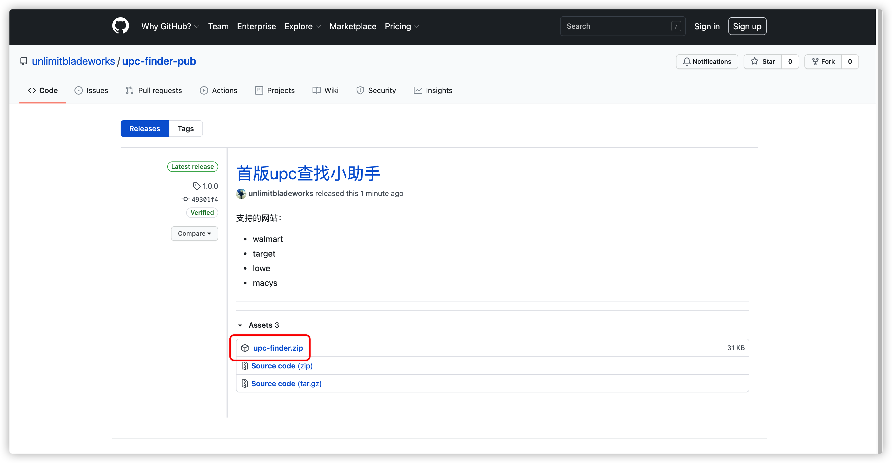
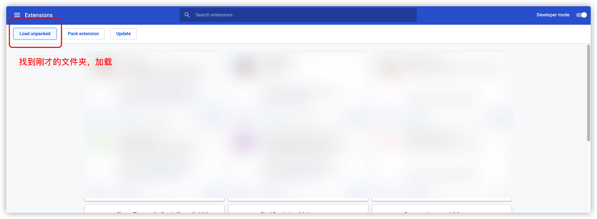
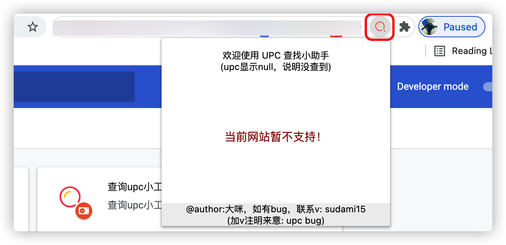
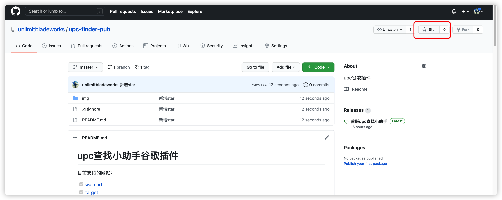
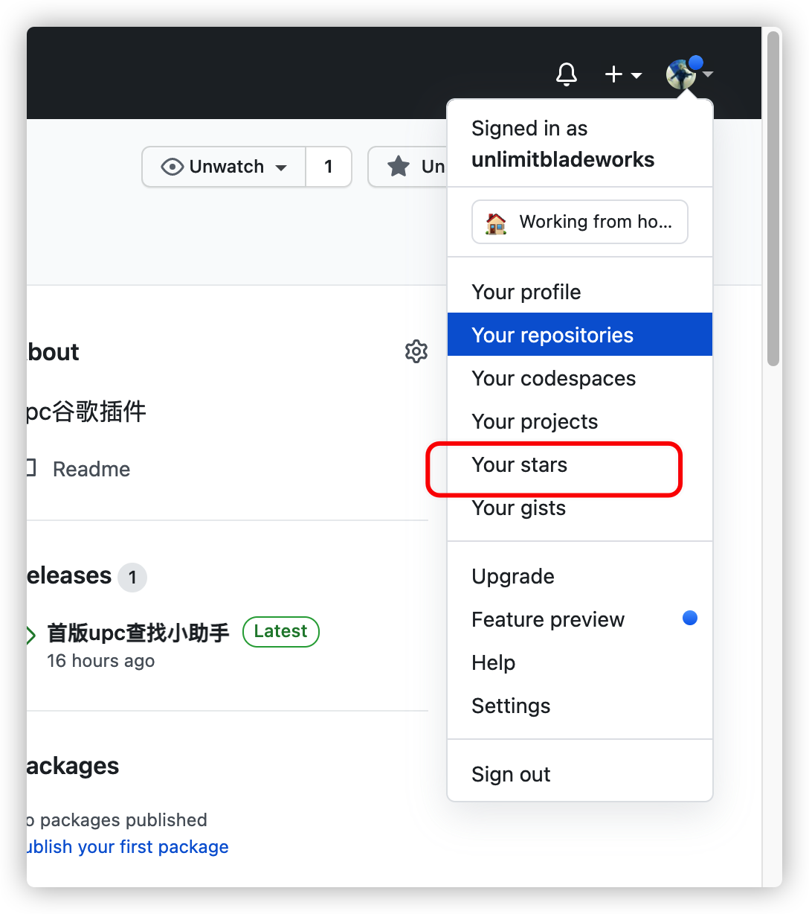
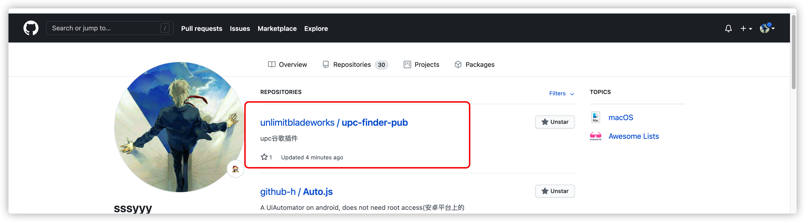

# upc查找小助手谷歌插件

目前支持的网站：

- [x] [walmart](https://www.walmart.com/)
- [x] [target](https://www.target.com/)
- [x] [macys](https://www.macys.com/)
- [x] [lowes](https://www.lowes.com/)

```diff
+ 注意：网站带有的变体商品，upc以当前进入详情页的商品为准。（若选择其他变体，upc可能还是主商品，需注意）
```

## 如何下载

打开github仓库地址，点击右侧的 release ：



在这里，可以看到每个新版本的插件和更新日志：



点击 zip 下载即可。

## 如何安装

找到一个固定的位置，解压 zip 文件
```diff
- 文件夹不要轻易移动否则插件失效
```


打开自己的谷歌浏览器扩展，点击左上方的 load ：




## 如何使用

加载完毕后，把插件固定在侧栏，打开对应网站的详情页，即可查看：




## 友情提示

各位若怕麻烦可以收藏本地址。

或者自行注册 github 的账号，点击上面的 star ，即可收藏。

1：登录账号后，点击右上方star

2：点击 you star

3：可以查看到



后续有新版本发布，会在右侧的 release 上显示。