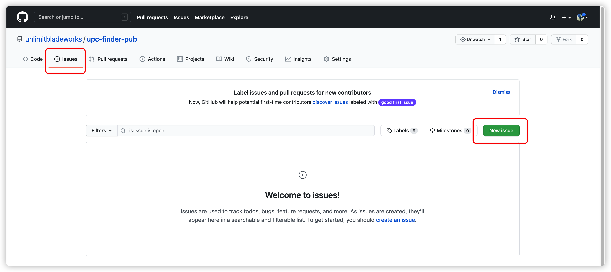
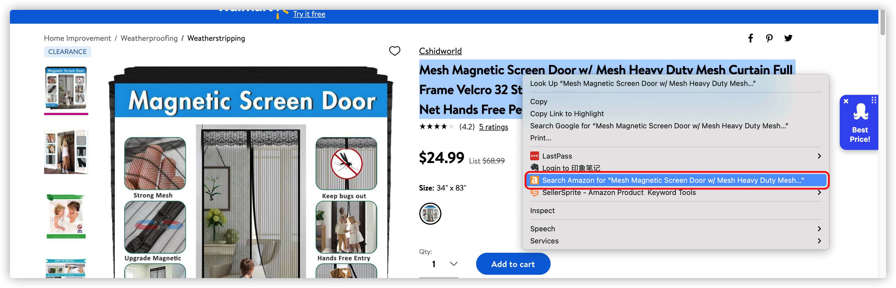

# upc查找小助手谷歌插件

目前支持的网站：

- [x] [walmart](https://www.walmart.com/)
- [x] [target](https://www.target.com/)
- [x] [lowes](https://www.lowes.com/)
- [x] [kohls](https://www.kohls.com/)
- [x] [macys](https://www.macys.com/)
- [x] [kvdveganbeauty](https://www.kvdveganbeauty.com/)

```diff
+ 注意：网站带有的变体商品，upc以当前进入详情页的商品为准。
+（若选择其他变体，upc可能还是主商品，需注意，但不影响查找商品）
```

## 如何下载

打开github仓库地址，点击右侧的 release ：


在这里，可以看到每个新版本的插件和更新日志：


点击 zip 下载即可。

## 如何安装

找到一个固定的位置，解压 zip 文件
```diff
- 文件夹不要轻易移动否则插件失效
```


打开自己的谷歌浏览器扩展，点击左上方的 load ：


## 如何使用

加载完毕后，把插件固定在侧栏，打开对应网站的详情页，即可查看：


以 target 为例，进入商品详情页后，点击小图标，即可查询跳转：


## 后续更新版本

后续有新版本发布，会在右侧的 release 中显示。

如何提交您想要的网站，两种方式。

其一，注册 github 账号，登录后，在下图中提出 issue ：



```diff
- 推荐该方式，能给大家留下网站参考
```

其二，加我个人微信，vx在插件中有留，使用过程中，若有bug也可以加我


## 友情提示

插件中，没有做根据标题查询亚马逊，因为市场上有Chrome插件可以解决，具体详见：

[right-click-amazon-search](https://chrome.google.com/webstore/detail/right-click-amazon-search/ehhhlpdgplkjdcgodmkgonnjhpkdiilc/related?hl=en)

选中标题，右键即可查询，如下图：



各位可以收藏本地址，便于后续更新下载。

或者自行注册 github 的账号，点击上面的 star ，即可收藏。

1、登录账号后，点击右上方star

2、点击 your stars

3、可以查看到


## 额外福利，批量根据 asin 查询销售权限


``` html
javascript:(function(){function httpRequest(url,callback){var xhr=new XMLHttpRequest();xhr.open("GET",url,true);xhr.onreadystatechange=function(){if(xhr.readyState==4){callback(xhr)}};xhr.send()}function getasins(){var asins=prompt('输入asin，请从excel复制过来并保证按每列排序');asins=asins.split('\n');return asins}function sleep(numberMillis){var now=new Date();var exitTime=now.getTime()+numberMillis;while(true){now=new Date();if(now.getTime()>exitTime)return}}var checkSellUrl='https://sellercentral.amazon.com/productsearch/search?query=';var asins=[];asins=getasins();var sellasins=[];console.log('asins:'+asins);asins.forEach(function(element){var url=checkSellUrl+element;httpRequest(url,(response)=>{var res=response.responseText;console.log('res:',res);var jsonObj=JSON.parse(res);var messages=jsonObj.products[0].qualificationMessages;console.log('messages:',messages);var flag=0;messages.forEach(function(message){var condition=message.conditionList;console.log('condition:',condition);var result=message.qualificationMessage;console.log('result:',result);if(condition.match('全新')&&result.match('批准')){flag=1}});if(flag==0){sellasins.push(element)}});var time=Math.ceil(Math.random()*3500);console.log('延时:'+time);sleep(time)});setTimeout(()=>{var heading=document.getElementsByTagName('h5')[0];var table=document.createElement("table");function createtr(element){var tr=document.createElement('tr');var td=document.createElement("td");td.innerText=element;tr.appendChild(td);table.appendChild(tr)}if(sellasins.length==0){createtr('所有商品均无销售权限！')}sellasins.forEach((element)=>{createtr(element)});heading.appendChild(table)},3000)})();
```

使用方法，在谷歌浏览器的书签页上中，新建一个网址，网址名字随意，网址内容复制上述代码到内容栏，点击确定即可。

使用时，登录亚马逊子账号，点击该书签页，从 excel 列复制 asin 即可。


⚠️风险提示：使用该工具建议创建子账号去查询使用，同时，每次复制 asin 建议不超过300。
 
该工具效率伴随着风险，我解释下为什么会有这种风险。
 
这个工具的原理是，我们用程序去批量模拟点击亚马逊后台的查询商品授权动作，如果用程序去模拟这个动作，3s以内可以模拟 1000 次。但实际上，人类点击查询按钮的动作间隔，最快至少也要间隔3s，才能点击一次进行查询。
 
在 @刘大白同学 原有的基础上，我加了每次模拟的时间间隔，每次随机在 8s 这个数字之间。
 
昨晚一次尝试，用 1000 个 asin 进行批量查询，再次刷新页面，直接提示我的流量异常了，需要让我手动输入验证码才能再次进入后台查询。（就和google异地登录有些类似）至于亚马逊后台对多少数据量会有风控提示，我们是不知道的，所以尽量调低每次复制的 asin 数量。
 
大家要意识到有这个风险存在。（目前除了让我输入验证码之外的操作，子账号还没出现什么其它的异常）。