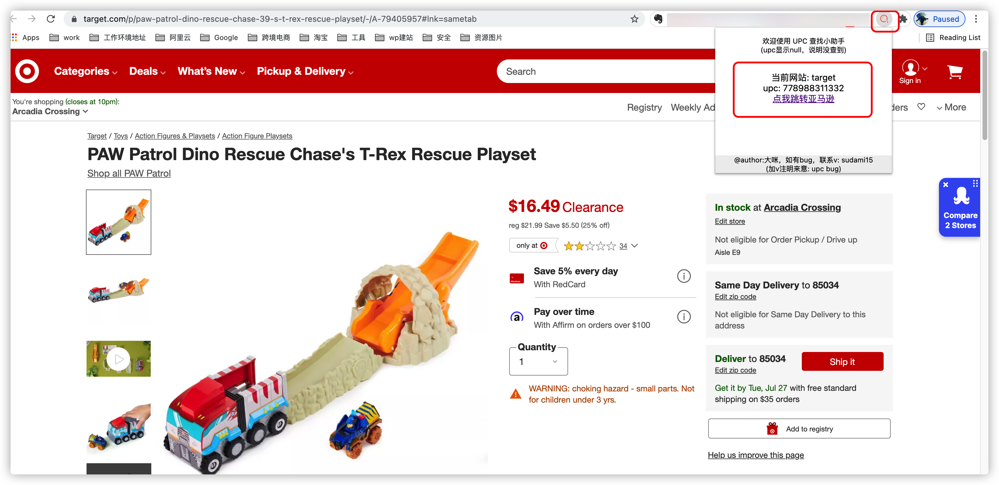

# upc查找小助手谷歌插件

目前支持的网站：

- [x] [walmart](https://www.walmart.com/)
- [x] [target](https://www.target.com/)
- [x] [lowes](https://www.lowes.com/)
- [x] [kohls](https://www.kohls.com/)
- [x] [macys](https://www.macys.com/)
- [x] [kvdveganbeauty](https://www.kvdveganbeauty.com/)

```diff
+ 注意：网站带有的变体商品，upc以当前进入详情页的商品为准。（若选择其他变体，upc可能还是主商品，需注意）
```

## 如何下载

打开github仓库地址，点击右侧的 release ：


在这里，可以看到每个新版本的插件和更新日志：


点击 zip 下载即可。

## 如何安装

找到一个固定的位置，解压 zip 文件
```diff
- 文件夹不要轻易移动否则插件失效
```


打开自己的谷歌浏览器扩展，点击左上方的 load ：


## 如何使用

加载完毕后，把插件固定在侧栏，打开对应网站的详情页，即可查看：


以 target 为例，进入商品详情页后，点击小图标，即可查询跳转：



## 后续更新版本

后续有新版本发布，会在右侧的 release 中显示。

如何提交您想要的网站，两种方式。

其一，注册 github 账号，登录后，在下图中提出 issue ：

!(issue提出)[img/10issue.png]

```diff
- 推荐该方式，能给大家留下网站参考
```

其二，加我个人微信，vx在插件中有留，使用过程中，若有bug也可以加我


## 友情提示

插件中，没有做根据标题查询亚马逊，因为市场上有Chrome插件可以解决，具体详见：

[right-click-amazon-search](https://chrome.google.com/webstore/detail/right-click-amazon-search/ehhhlpdgplkjdcgodmkgonnjhpkdiilc/related?hl=en)

选中标题，右键即可查询，如下图：


各位可以收藏本地址，便于后续更新下载。

或者自行注册 github 的账号，点击上面的 star ，即可收藏。

1、登录账号后，点击右上方star

2、点击 your stars

3、可以查看到

